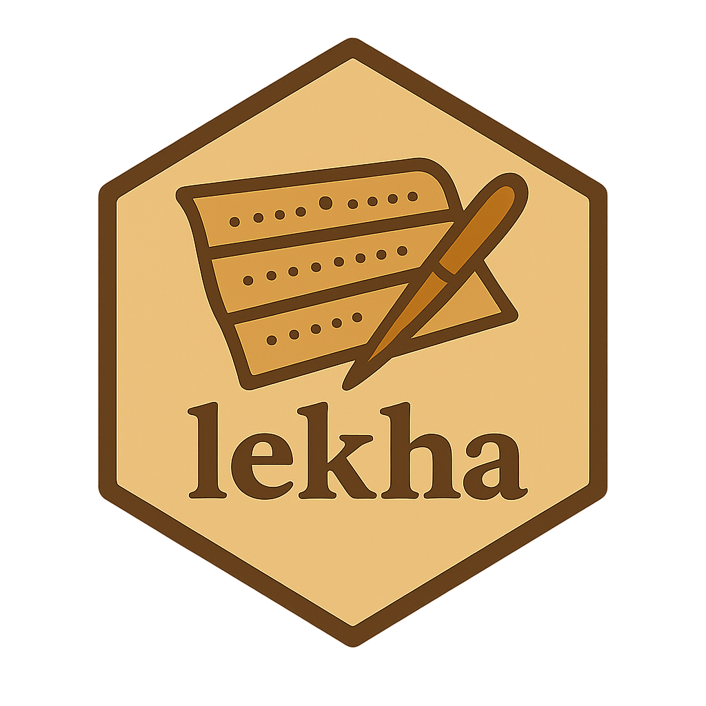

# Lekha 


Easier manuscript transcription with OCR correction suite.


## Quickstart

```bash
python -m pip install -e .
lekha -l LANG /path/to/manuscript
```

If you invoke `lekha` without arguments, it will offer previously processed
projects to resume.

> **Note**  
> Tesseract must be installed separately and available on your PATH. Lekha uses
> `pytesseract` when possible and falls back to the `tesseract` CLI.


## Development

- `typer` powers the CLI.
- `Flask` serves the API and static assets for the web viewer.
- Tests are not included yet; verify manually by running the CLI and exercising
  the viewer.
