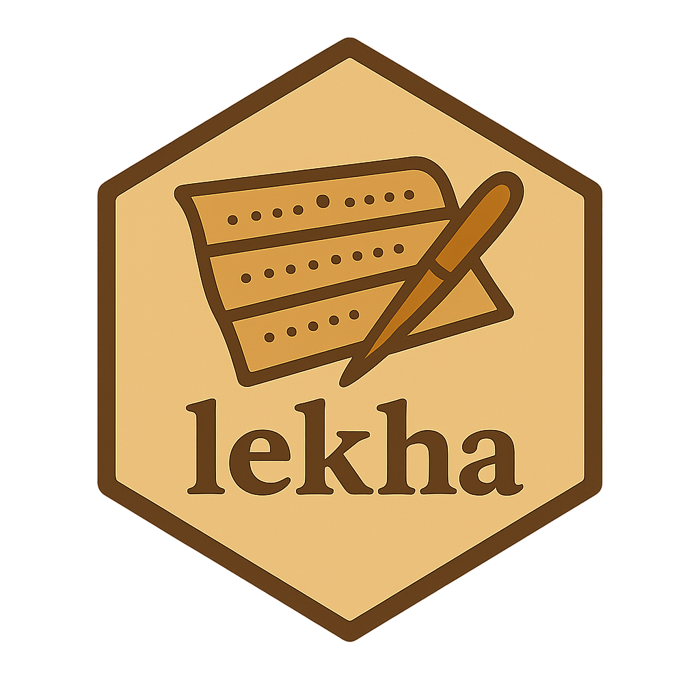

# Lekha 


Easier manuscript transcription. 


## Quickstart

```bash
# python -m venv .venv
# source .venv/bin/activate
python -m pip install -e .
lekha -l LANG /path/to/manuscript
```

If you invoke `lekha` without arguments, it will offer previously processed
projects to resume.

> **Note**  
> Tesseract must be installed separately and available on your PATH. Lekha uses
> `pytesseract` when possible and falls back to the `tesseract` CLI.
